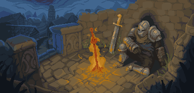

  

  
  

  <h2 align="center"> ⚜️ About me ⚜️</h2>

  

    
  

  

    <ul align>
      <li>Computer Engineer student 💻</li>
      <li>currently using Debian 12 :penguin:</li>
      <li>⚔️Fantasy and SciFi 🌌 enjoyer </li>
      <li>🎶Music lover🎶</li>
      <li>Wanting to be a cybersecurity analist 🕵🏽‍♂️</li>
      <li>Always ready to give all I have</li>
    </ul>
  

  <h2 align="left"> 📖Knowledge📖 </h2>

  

    
  

***

  

    
Github Stats⚡

    
    
    
  

  

  <h2>Contact me </h2>
  
  
  

